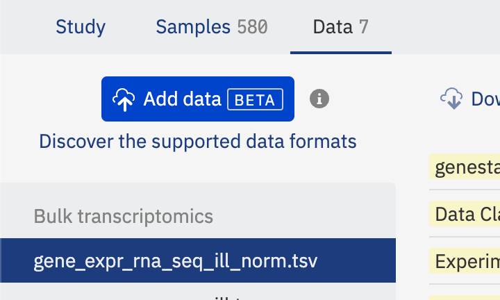
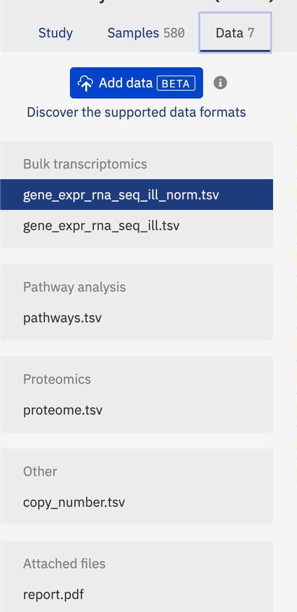
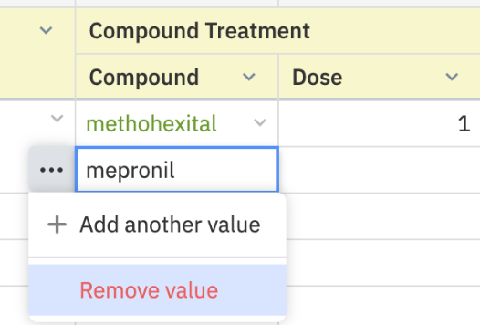

# Release notes

!!!info "Target users"

    **Curators** - users who add new data into ODM and are responsible for the data harmonization and curation. That includes creating and defining metadata templates, mapping metadata and temples, and data updates.

    **Researchers** - users who access ODM to identify a batch of data suitable for further research and analysis. That includes search, data browsing and export.

    **Advanced** - users who can utilize advanced API functionalities for user management and data management.

    **Admins** - users who manage organization in ODM, its user and groups.

## 1.55 Open Data Manager 2023 Winter Release

### New Features

-   **[Curators, Advanced, Admin] Manage Data**
    -   **New Swagger Page**: Introducing new endpoints for managing detached objects and deleting objects in ODM.
        -   `GET/detached-objects`: Identifies detached data objects (Samples, Libraries, Preparations, Tabular Data, VCF, and Flow Cytometry data) that are not linked to other objects, aiding in clean-up after incomplete data uploads or deletions.
        -   `DELETE/data`: Facilitates cascade deletion of selected objects from ODM. For instance, deleting a Study also removes all linked objects (Samples, Libraries, Tabular Data, VCF, etc.). Access restricted to users with `MANAGE_ORGANIZATION` and `ACCESS_ALL_DATA` permissions.
-   **[Curators] Data Uploading Enhancements in GUI**
    -   **Enhanced Tabular Data Handling**: Supports specifying a separator character in file column headers for distinguishing between sample names and measurement types.
    -   **Advanced Options**:
        -   **Skip Zeroes (Sparse Data Matrix)**: Option to ignore cells with '0' values to optimize performance for datasets common in single-cell technologies.
    -   **Pre-validation**: All data files uploaded from the local computer undergo a formatting compliance check before uploading.
    -   **File Attachment Updates**: If an attached file already exists in ODM, the system offers options to overwrite or rename the file.

### Fixed Major Issues

-   **GUI Issues**:

    -   [Curators] Fixed the issue where Bulk Replace doesn't replace some empty values in the Metadata Editor.
    -   [Curators] Resolved incorrect behavior when copying/reassigning string values to integer/decimal types.
    -   [Curators] Addressed the issue preventing the import of Sample Metadata to a Study with existing attached files or failed tabular data uploads.
    -   [Users] Corrected the issue with incorrect data file names in export archives.

-   **Scripts and API Issues**:
    -   [Curators, Advanced] Fixed the error occurring during the simultaneous upload of multiple files with over 2000 samples.
    -   [Curators, Advanced] Resolved the issue where the curation script does not publish changes.
    -   [Curators, Advanced] Aligned the behavior of the curation script with GUI functionality, particularly for the "Re-assign" feature.
    -   [Advanced] Addressed issues with streaming data endpoints, including excessive log entries, incomplete results under high demand, and malfunctioning with custom attribute-linked Tabular Data.
    -   [Advanced] Fixed errors related to long IP addresses and unexpected errors with Access Token requests.

### Other Changes

-   **Data Archive Removal**: All export data archives previously generated in the ODM GUI will be deleted. New export archives can be generated on demand.
-   **Custom SSE-KMS Key**: Introduced the ability to specify a custom SSE-KMS key for data uploading in the ODM GUI.

<hr/>

## 1.54 Open Data Manager 2023 Summer Release

ODM – renamed to **Open** Data Manager.

### [All users] Expanded Data Capabilities

ODM now supports TSV-formatted data frames. This expansion beyond GCT 1.2, VCF, and FCS formats enables the upload of diverse data types such as proteomics, metabolomics, epigenomics, and analysis results. This requires adherence to the data frame specifications provided in the [User Guide](https://odm-user-guide.readthedocs.io/en/latest/doc-odm-user-guide/supported-formats.html#tabular-data).

Simply put, your data file can now accommodate multiple columns defining the measured feature and more than one measurement column per sample.

Example of Mass Spectrometry data: Feature columns can encompass: `Gene Name`, `Protein Name`, `Peptide sequence`, `PTM site`, `M/Z ratio`, `Retention time`, etc. Measurements per sample may include: `Signal intensity`, `Signal quality`, etc.

Data upload is possible via the GUI/API, and querying can be executed via the API (see details below).

### [Curators] Enhanced Data Uploading

The revised data uploading function is available as a **BETA** version in both the API and GUI. This feature will be improved in upcoming releases.

### [Advanced] API Improvements

At present, uploading of TSV-formatted data is executed through Expression endpoints, with future releases introducing new endpoints for this operation.

Utilize the following endpoints to upload TSV or bulk transcriptomics data in GCT 1.2:

`post/expression/gct`

`post/import/expression`

We've added two new parameters for these endpoints (detailed descriptions available on corresponding Swagger pages):

-   `numberOfFeatureAttributes` - to specify the number of feature columns in the file.
-   `dataClass` - to denote the data type (e.g., proteomics, metabolomics, etc.).

### [Curators] GUI Adjustments

The `Create new study` button has been relocated to the center of the screen.


The `Add Data (BETA)` button has been incorporated into the new Data tab (further details about the tab below).

<figure markdown>
  {width=360}
</figure>

You now have the ability to import TSV, GCT, VCF, or FCS data from your local computer or via a direct link.

<figure markdown>
  {width=480}
</figure>

Moreover, this button can also be used to attach any file to the study.

<figure markdown>
  {width=480}
</figure>

Please refer to the [User Guide](https://odm-user-guide.readthedocs.io/en/latest/doc-odm-user-guide/import-samples-spreadsheet.html#import-data-beta) for more information on these functionalities.

The Metadata Editor now includes an option to add new custom fields for Study and Data metadata.

<figure markdown>
  {width=280}
</figure>

### [Researchers] Enhanced Data Browsing and Export

The `Signal Type` filter has been replaced with the Data Class filter, which represents all available data types across studies.

<figure markdown>
  {width=320}
</figure>

The `Signal Type` column has been removed from the main study browser panel.

The Expression/Variant/Flow Cytometry tabs have been removed from the Metadata Editor page.

A new `Data` tab has been added to the Metadata Editor page. This tab displays a list of all data files uploaded for the study, organized by their respective `Data Class` parameter (selected during file upload) on the left panel.

<figure markdown>
  {width=320}
</figure>

Clicking on a file enables metadata editing [Curators only] and browsing.

The metadata now includes four mandatory read-only fields that are auto-generated:

-   Data Class - the data type selected during file upload.
-   Features (string) - string feature column names present in the file (e.g., `Gene Name`).
-   Features (numeric) - numeric feature column names present in the file (e.g., `M/Z ratio`).
-   Value (numeric) - measurement types if more than one measurement is available per sample/library/preparation (e.g., `Fold Change`, `p-value`).
    <br/>{width=300}

These fields are implemented to make the content of these files visible and searchable for data science users. We strongly advise against editing these fields in the template editor, as it could make these files inaccessible. If data is uploaded in the GCT format, `Features (string)`, `Features (numeric)`, and `Value (numeric)` fields are left empty (due to the standard structure of GCT files).

### [Advanced] API Retrieval Improvements

The uploaded data can be searched and extracted using the API endpoint. Similar to the uploading process, data retrieval is performed through Expression parameters of Omics queries (Integration group), with future releases set to introduce new endpoints for this operation.

<figure markdown>
  {width=640}
</figure>

Each endpoint of Omics queries now has two updated parameters:

-   In the `responseFormat` parameter, use the `multi_values` value to extract data in the new format. If your data has multiple features/measurements, they will be extracted in full. If the parameter is unspecified, the output returns only the first feature column and the first measurement per sample. This modification was introduced to maintain backward compatibility for applications built for GCT data extraction.
-   `exQuery` has been enhanced and now supports flexible searches across files of any content. Search parameters in `exQuery` include options for feature and measurement filtering:
    -   To search by feature (feature keyword), specify the required column name, e.g., `feature.Genes="ZNF814"`.
    -   To search by measurement type (value keyword), specify the required column name, e.g., `value.intensity > A`.

New search capabilities include exact matches, multiple matches, range filtering, substring search, search by missing values, and more. Please refer to the corresponding endpoint descriptions in Swagger for details.

### Known Issue

If more than one file with the same name and extension is imported or attached via `Add Data (BETA)` button, then `Export` of the entire Study in one archive does not work.

Do not import/attach files with exactly the same name (and extension) to avoid this issue.
In case, two files with the same names were uploaded, you need to download them one by one.

<figure markdown>
  {width=420}
</figure>

<hr/>

## 1.52

### GUI features

#### [Curators] Revoking access to a study

Added an ability to unshare a study (revoke access to a study) from a certain user group in Metadata Editor. The feature is available only to the study owner.

<figure markdown>
  {width=400}
</figure>

#### [Curators] Removing a multivalue while editing samples in Metadata Editor

Users can manually remove one of the values in a row with multiple values while editing a metadata sample in Metadata Editor. Previously, multi-valued "No Value" rows were automatically removed only after a new version of the sample metadata was published.

<figure markdown>
  {width=320}
</figure>

#### Fixed issues

[Curators].[Metadata Editor] Sometimes sample attributes (with attached dictionaries) with empty values are marked in Metadata Editor as invalid.

[Curators].[Metadata Editor] When multi-value rows in the composite sample attributes have no value, they are merged and not shown in Metadata Editor. In the example, there are "Compound Treatment/Compound", "Compound Treatment/Dose", and "Compound Treatment/Unit"; it is impossible to determine which "Dose" values correspond to a proper "Compound".

<figure markdown>
  {width=420}
  <figcaption>Before fixing the issue</figcaption>
</figure>

<figure markdown>
  {width=420}
  <figcaption>After fixing the issue</figcaption>
</figure>

[Curators].[Metadata Editor] The default dictionary "Cell type" can not be used during the validation of the samples in Metadata Editor. Also, this dictionary cannot be reloaded into ODM.

[Curators].[Metadata Editor] Incorrect sample count is shown on the bulk replace attribute editor dialogue.

[Curators].[Template Editor] The exported json file with template attributes contains only the fields visible in the Template Editor. We have removed the outdated "isSingle" attribute from the file, which could lead to errors when reloading the template to ODM.

### API Changes

#### Fixed issues

[Advanced users] An issue with more than one AND operator in the omics metadata filters.

<hr/>

## 1.51

### New/updated features in this release

**API. Updating the feature of the data upload via NFS** [Curators, Advanced].

??? example "Click here to expand"

    Сurators can import study files from a locally mounted Network File Storage (NFS) to ODM with "write" OR "read-only" access permission. There is no need to configure the “write” permission for the files, as it was before.

**Authentication in API via access token of an identity provider** [Curators, Advanced].

??? example "Click here to expand"

    ODM API and the "import_ODM_data.py" script allow authentication with a Genestack API token OR with an access token of another identity provider. To specify a custom access token, use the "Authorization" header; to set the Genestack API token, use the "Genestack-Api-Token" header.

    Note: access token takes precedence, meaning that if both tokens are supplied, the access token will be used for processing the request. The expansion fully supports Azure Active Directory access tokens. For a different custom Identity Provider, please test ODM API beforehand.

**Linking samples and omics data by any custom key via API** [Curators, Advanced].

??? example "Click here to expand"

    Previously: samples from metadata and omics data files could be linked only using the "Sample Source Id" attribute as a reference. Now curators can choose any sample metadata attribute (column) as a reference to link samples.

    Notes: only template attributes can be used for the linkage; if the value of the sample attribute for the linking changes, the relationship between samples and omics data is not updated automatically. More details about this feature you can find in the swagger, the endpoint `POST/integration/link/expression/group/{sourceId}/to/sample/group/{targetId}`, `linkingAttribute` parameter.

### Fixed issues in the metadata curation process

[Curators] Fixed: a template attribute with invalid metadata is marked as "non-template" when a curator is editing sample metadata in Metadata Editor via the bulk replace.

[Curators] Fixed: a formatting error appears for the study metadata view-only mode when the text in an attribute is not transferred to the next row.

[Curators] Fixed: other minor bugs in Template Editor and Metadata Editor.

### Fixed issues in API

[Advanced] Fixed: the API endpoint GET/omics/expression/streamed-data does not return a proper error when a user specifies a wrong accession of the signal group in the groupAccession parameter. Now the endpoint returns an error 404 Not Found with the message `"Group 'N' could not be found"`.

<hr/>

## 1.50

### New/updated features in this release

**SCIM API for managing users and groups in ODM via Azure Active Directory** [Admins].

??? example "Click here to expand"

    We have added SCIM API endpoints that allow the organization admin to manage users and user groups in ODM via Azure Active Directory. You can find all information about these endpoints and their limitations in Swagger in the "Manage Organization" section. Active Directory and ODM integration via SCIM endpoints instruction is located in the admin guides.

    Since the API endpoints have been developed according to the SCIM 2.0 specification, you can use them with any identity provider that supports working with SCIM. But since each identity provider has custom specifications, we recommend the solution pre-testing.

    We recommend calling user and group synchronization in Active Directory on behalf of the user with the "Manage Groups" permission so that the user can see and edit all groups on the instance, regardless of whether the user is a member of the groups or not.

**Quick start guide videos are added across ODM** [Curators, Researchers].

??? example "Click here to expand"

    Each page contains a button that leads to a video explaining how to work with the page and the related main concepts. In addition, a welcome pop-up appears after the first login. The pop-up contains a link to the Quick Start Guide help page and all videos. Now users can get acquainted with the possibilities of ODM even faster and more conveniently on their own.

### Fixed issues

[Curators] The import_ODM_data.py script incorrectly handled unexpected server responses from URL provided with `--server`: server is down for any reason or a user mistake. Now the script returns an error with clear instructions.

<hr/>

## 1.49

### New/updated features in this release

-   The ability to load files to ODM from a local machine with installed ODM via NFS is added. To load files to ODM, users should use Job API endpoints for async loading, e.g., `POST /import/expression` with `"source": "LOCAL"`. Loading mapping files from a local machine via `POST /xrefsets` is not supported.
-   The `main()` function is added to the `import_ODM_data.py` script.
-   Dictionaries without any term can be loaded to ODM. And if such a dictionary is assigned to an attribute in the template, this attribute is treated as a free text attribute in Metadata Editor. Any text that the user enters is valid.

### Fixed issues

-   Fixed: Sometimes, a wrong sample count is displayed in the Study Browser after importing a study to ODM.

### Known issues

-   Metadata Editor: There is no automatic formatting of numeric values, they will be displayed as strings – aligned to left instead of right.
-   The study browser may continue to show and search facet values from objects that have been unlinked from studies.

<hr/>

## 1.48

### New/updated features in this release

-   API endpoints for working with user accounts have been introduced, all endpoints require the "Manage organisation" permission (user should be Admin in ODM):
    -   `GET /groups`: the endpoint returns a list of non-deleted user groups in which the user is a member of the group. Users can be filtered by their attributes, e.g. by `displayName`;
    -   User accounts can be created and updated using `POST /users` endpoint;
    -   Attributes of a specific user account can be updated by `PATCH /users/{id}` endpoint.
-   Improvements in the Metadata Editor:
    -   Attribute description and its data type are shown in the attribute menu and the bulk replace dialogue;
    -   Share-study dialogue was redesigned. When a user shares a study with a new group, the user can see a list of the groups with which this study has already been shared.
-   A new permission “Manage groups” was implemented, it allows to retrieve all user groups.
-   Improvements in API:
    -   Performance is improved for the cases of a significant amount of patch requests (with disabled metadata versioning on the instance);
    -   Optimization of omics query results in faster queries, and the system stability (less memory per processor is used, etc.).
-   The code quality and maintainability of the import_ODM_data.py python script for data loading to ODM have been improved:
    -   All argument keys use dashes consistently, e.g. `--mapping-file`. Arguments with underscores are still supported, e.g. `--mapping_file`;
    -   User can load large files with preparations and libraries (>10 000 rows) via the `Import_ODM_data.py` script since the script uses async API for data loading.
-   The documentation covering `update_templates.py` script has been updated.

### Fixed issues

-   Fixed: querying signal runs via `GET /expression/runs/by/group/{id}` returns incorrect "total" in pagination info.

### Known issues

-   Metadata Editor: There is no automatic formatting of numeric values, they will be displayed as strings – aligned to left instead of right.
-   The study browser may continue to show and search facet values from objects that have been unlinked from studies.

<hr/>

## 1.47

### New/updated features in this release

-   The "Description" field is added for attributes in Template Editor. The field can be used to store a brief explanation of what each attribute was intended for, examples of values, etc. The maximum length of the description is 500 characters.
-   Attribute descriptions, which provide a brief explanation of what each attribute was intended for, examples of values, etc., are added in Metadata Editor. A description of each attribute can be edited in the study template.
-   The "Description" attribute is supported in the python script for loading templates.
-   Curate libraries and preparations metadata using the curation script.

### Fixed issues

-   Fixed: dates are displayed in milliseconds in the view mode of Metadata (e.g., `"1638448612812"` instead of `"December 2, 2021"`).
-   Fixed: when a new template is created using the Duplicate function of the Template Editor, the page does not indicate whether the new template has been generated.

### Known issues

-   Metadata Editor: There is no automatic formatting of numeric values, they will be displayed as strings – aligned to left instead of right.
-   The study browser may continue to show and search facet values from objects that have been unlinked from studies.

<hr/>

## 1.46

### New/updated features in this release

-   When the user switches between editing and viewing modes in the Metadata Editor, the selected filters are saved (there is no need to choose and apply them again).
-   Visual distinction highlight of template vs. non-template attributes is added to all tabs of the Metadata Editor.
-   More effortless study curation when changing the applied template or applying a new template that causes a change in the attribute data types. Previously: if e.g., the `age` field is a `string` attribute, it is changed to become an `integer` attribute in a new applied template. This attribute's previously valid values were marked as `invalid`, so the user had to edit each value.<br/>
    Currently: the user can call a mass conversion of the value types according to the applied template.<br/>
    The following type conversions are supported: `Text` -> `Integer`, `Text` -> `Decimal`.
-   The user confirmation request was added to the Template Editor for the attribute removal from the template. It avoids accidental removal of the attribute or changing the validation rules used in studies.
-   MySQL version has been upgraded to `8.0.28` to avoid vulnerabilities in the previous version.
-   ClickHouse is updated from `21.8` to `21.12`. The ClickHouse logs are more straightforward. Investigating ClickHouse problems has become easier.

### Fixed issues

-   Fixed: the application returns an error when adding a new facet in the "Configure facets" application with underscores in the name (e.g., `Study_Type` instead of `StudyType`), and saving the changes.
-   Fixed: an incorrect number is displayed in the counter on the Samples tab in Metadata Editor after applying filters.
-   Fixed: switching from the edit mode to the view mode causes an error "Page unresponsive" while working with a study with more than 10k+ samples in Metadata Editor.
-   Fixed: The filters in the Metadata Editor were not updated while the user was editing the sample attributes. E.g., the user filters samples by `Disease = Asthma`; updates the value of one of the attributes from `Asthma` to `Cancer` and does not publish changes; then the sample is continued to be returned in filters by `Disease = Asthma`.
-   Fixed: the user needs to refresh the page in the Metadata Editor to publish the changes.
-   Fixed: The user receives an error message when reassigning an attribute to a column with integer values on the Samples tab in Metadata Editor.
-   Fixed: Obsolete dictionaries were not highlighted in red in the Template Editor application; the user could have mistakenly selected an outdated dictionary for an attribute.

### Known issues

-   Metadata Editor: There is no automatic formatting of numeric values, they will be displayed as strings – aligned to left instead of right.
-   The study browser may continue to show and search facet values from objects that have been unlinked from studies.

<hr/>

## 1.45

### New/updated features in this release

-   Solr `8.11.1` version is updated to resolve the `log4j` vulnerability.
-   Full-text and facet search for studies via API endpoint `POST /integration/fulltext/search/studies`. The endpoint allows searching for studies by study metadata and all linked objects' metadata (e.g., samples, libraries, preparations, omics metadata). Examples:

    a) find all studies where the term "cancer" occurs in the data, e.g., in samples or the study description;

    b) find all studies by a specific facet `"Disease" = "Asthma"` (the endpoint performs search only across facets defined in the "Configure facets "application).

    The endpoint returns:

    -   a list of studies with the metadata summary;
    -   a list of facet objects with counts (the same list of facets shown in the "Study Browser" application).

-   Asynchronous loading of files with "preparation" information via API endpoint `POST /import/preparations` to upload files with more than 10k rows.
-   The performance of filters in Metadata Editor in edit mode was improved (1.5 times faster processing on the Genestack test environment). The exact time difference depends on the instance settings and the connection provider.
-   Ability to copy values and reassign attributes for both template and non-template attributes in Metadata Editor.
-   The `import_ODM_data` python script now supports versions of Omics data files. Thus, the user can upload a new omics data file to an existing study using the "import_ODM_data" python script as the next version of the previously uploaded file. The solution has limitations described in the python script documentation.
-   Synchronous uploading performance of samples via the API endpoint `POST /samples` was improved (2.7 times faster processing on the Genestack test environment). The exact time difference depends on the instance settings and the connection provider. Now optional "Warning" attribute with the results of sample validation for the applied template is not returned in the response body.
-   The deprecated endpoint for loading cross-reference (xref) mapping files `POST ​/import​/transcript-mapping` method has been removed; the endpoint call returns an error. For cross-reference mapping files loading user can use `POST /xrefsets`.
-   The "View Logs" button is removed from the Export page.

### Fixed issues

-   **Breaking changes!** The method `get_parents_by_study` was renamed to `get_groups_by_study` in Python and R SDK. If your application uses the methods `get_parents_by_study`, rename all the method usages to `get_groups_by_study`. If your application does not use R or Python SDK, no changes are required.
-   If the mapping file contains duplicates, the endpoint loads only unique rows. A warning regarding duplicates is returned in the response body, e.g., "The loaded file includes three duplicate rows that were skipped". Previously, when the user loaded mapping files with duplicate rows via `POST /xrefsets`, the endpoint stopped the file loading on the first duplicate and did not return the warning message. The user did not know whether the entire file was loaded or not.
-   When a user applies another template to a study in Metadata Editor, the new validation rules are immediately applied. It allows the user to see the actual data, the actual set of required attributes, and the actual status of the data validation. Previously, the user needed to refresh the page to enable it.
-   Fixed: when a user adds and removes the multi-value field in Study Metadata, the error is returned.
-   R SDK documentation is improved:
    -   An example "include "parameter value is added to the description.
    -   Clients receive an exception when passing unknown parameters in functions.
-   Fixed: API endpoints for removing links between objects return code `204` if the specified object of a wrong type or there was no link between objects. The endpoints return `404` with a message corresponding to the case. Affected `DELETE` endpoints:
    -   `/integration/link/sample/{sourceId}/to/study/{targetId}`
    -   `/integration/link/sample/group/{sourceId}/to/study/{targetId}`
    -   `/integration/link/library/{sourceId}/to/sample/{targetId}`
    -   `/integration/link/library/group/{sourceId}/to/sample/group/{targetId}`
    -   `/integration/link/preparation/{sourceId}/to/sample/{targetId}`
    -   `/integration/link/preparation/group/{sourceId}/to/sample/group/{targetId}`
-   Fixed: the swagger page does not become unresponsive when the user calls the endpoint `GET /sampleCurator/samples` without specified `pageLimit`, and there are more than 2000 samples.

### Known issues

-   Metadata Editor: There is no automatic formatting of numeric values, they will be displayed as strings – aligned to left instead of right.
-   The study browser may continue to show and search facet values from objects that have been unlinked from studies.

<hr/>

## 1.44

!!!info "Deployment note"

    Versions from `1.42` onwards use a new schema for core ClickHouse tables. The previously released version `1.41` includes migration scripts so deployment of `1.41` and completion of this migration job must have taken place before deploying any version from `1.42` onwards.

### New/updated features in this release

-   Filters in the Metadata Editor are now applied faster.
-   The Metadata Editor allows scrolling across the table.
-   Ontology-aware search for RDF-formatted ontologies: When using the search bar in the Study Browser exact and related synonyms are added to the search query by default (where the user’s query matches a term from an ontology). Users can also extend the results of a query by toggling inclusion of all child (descending) terms.
-   Study Browser results summaries now include metadata from these additional fields: `Data Species`, `Species Name`, `Sample Type` and `Disease Status`.
-   Users can load libraries data objects asynchronously via a new endpoint `POST /import/libraries`. The endpoint returns a `jobExecId`, and the results can be checked via the Job operations endpoint.

### Fixed issues

-   Critical security vulnerability was fixed in `log4j`.
-   Fixed exporting omics data where metadata versioning feature is enabled.
-   Edit mode in the Metadata Editor no longer causes timeouts with large (50,000) samples tables.
-   Reassigning attribute now correctly deletes the source column from view mode as well as from edit mode in the Metadata Editor.
-   Metadata Editor now has correct filters descriptions when values are updated.
-   Links are recognized and clickable in the view mode of the study metadata tab.
-   Users now see the correct facets values for bulk replace after discarding changes.
-   The correct number of available samples is shown after filtering.
-   Incorrect use of the template was fixed for Bulk replace in Library/Preparation metadata.
-   Fixed a problem with unpublished versions after turning on metadata versioning feature.
-   Curation script works for Variant, Expression and Flow Cytometry metadata as well as for tabs `Study` and `Samples`
-   Loading of `vcf` files with values `nan` was fixed

### Known issues

-   Metadata Editor: There is no automatic formatting of numeric values, they will be displayed as strings – aligned to left instead of right.
-   The study browser may continue to show and search facet values from objects that have been unlinked from studies.

<hr/>

## 1.43

!!!note "Deployment note"

    Versions from `1.42` onwards use a new schema for core ClickHouse tables. The previously released version `1.41` includes migration scripts so deployment of `1.41` and completion of this migration job must have taken place before deploying any version from `1.42` onwards.

### New/updated features in this release

-   Full text search in the Study Browser now supports ontology expansion - if a search term matches a term from an ontology in RDF format then it is possible to extend the query to include child terms (those with the `subClassOf` property), up to a limit of 30,000 child terms (and synonyms).
-   Full text search now automatically includes exact and related synonyms (`hasRelatedSynonym` or `hasExactSynonym` in the RDF)
-   There is a new `roundDigits` request parameter for the /streamed-data endpoint. By default `roundDigits = 4`

### Fixed issues

-   Metadata Editor: Renaming a study via the contextual menu now creates a new version (if metadata versioning is enabled).
-   Users who singed in using SSO (`OAuth2`) now can re-sign in via one click again after being logged out due to security reasons.
-   Now it is possible to undo (<kbd>ctrl+z</kbd>) and redo (<kbd>ctrl+shift+z</kbd>) manual changes to metadata.
-   The metadata validation summary now correctly reports valid metadata when all metadata is valid.
-   `UserEndpoint` APIs return latest draft (staging) versions of signals metadata when versioning feature is disabled, ensuring users get the latest version of the data.
-   Swagger endpoints have had some extraneous descriptions removed.
-   Swagger description for `GET /omics/expression/streamed-data` has been improved.

### Known issues

-   Metadata Editor: There is no automatic formatting of numeric values, they will be displayed as strings – aligned to left instead of right.
-   The study browser may continue to show and search facet values from objects that have been unlinked from studies.

<hr/>

## 1.42

!!!note "Deployment note"

    Versions from `1.42` onwards use a new schema for core ClickHouse tables. The previously released version `1.41` includes migration scripts so deployment of `1.41` and completion of this migration job must have taken place before deploying any version from `1.42` onwards.

### New/updated features in this release

-   Metadata versioning is available as a beta feature. To enable it see the administration guide. By default it is not enabled.
-   The `POST /task/publish-versions` API endpoint was added to support metadata versioning.

### Fixed issues

-   Metadata Editor: Applying a new template is now reflected immediately without needing a page refresh.
-   Metadata Editor: Copying/previewing sample accessions now work correctly with pagination.
-   A bug with session tokens after a server restart has been fixed.
-   Adding samples via `POST /integration​/link​/sample​/group​/…​/to​/study​/…` now correctly shares these samples with the same permissions as the study being added to.
-   The Uberon ontology now successfully initiates on instances with HTTP(S) proxies.

### Known issues

-   Metadata Editor: There is no automatic formatting of numeric values, they will be displayed as strings – aligned to left instead of right.
-   The study browser may continue to show and search facet values from objects that have been unlinked from studies.

<hr/>

## 1.41

!!!note "Deployment note"

    This release contains a periodic job which automatically migrates core ClickHouse tables (`ExpressionDataByRun`, `ExpressionDataByGene`) to a new schema. It is mandatory to let this job finish before installing future releases (`1.42` etc.) as they will not support the old schema. The job is finished when the backend logs contain the messages: `Migration of data for table {} finished`, where `{}` is `ExpressionDataByRun` and `ExpressionDataByGene`.

### New/updated features in this release

-   Minor dashboard text changes
-   The Template Editor URL has changed to a Base URL of: `frontend/endpoint/application/run/genestack/web/templates`<br/>
    Redirects are in place for the previous URL.
-   Improved use of server resources (disk space in particular)
-   Improved performance of omics data queries

### Fixed issues

-   Metadata Editor: Fixed an issue filtering by invalid values works for Integer/Date data types. Now users can use date/integer values for filtering even if they are invalid according to the template
-   Metadata Editor: Dictionary terms are now correctly highlighted after changing template.
-   An Expression data query performance degradation bug has been fixed
-   Patch API calls now work on large sample numbers
-   Omics queries: Filtering of variants by INFO fields in text format is working now, e.g. `vxQuery = info_VT=INDEL`

### Known issues

-   Metadata Editor: There is no automatic formatting of numeric values, they will be displayed as strings – aligned to left instead of right.
-   The study browser may continue to show and search facet values from objects that have been unlinked from studies
-   The curation helper script doesn't work for Variant, Expression and Flow Cytometry objects, only for studies and samples

<hr/>

## 1.40

!!!note ""

    Customers should update their SSL settings to use a `2048-bit` or greater DH cipher

### New/updated features in this release

-   Study Browser: Added a syntax cheatsheet that describes how to use advanced full-text search capabilities
-   Metadata Editor: Added a new export button to export all data/metadata of a study
-   Export: Exports now include a readme detailing the files contained in the archive
-   API endpoints: A `400` http code is now returned when an unknown parameter is supplied to any endpoint

### Fixed issues

-   Metadata Editor: Fixed an issue editing fields at the bottom of the window
-   Study browser: Fixed saved bookmark icons
-   Omics data files are exported with the same extensions that they were imported with

### Known issues

-   Metadata Editor: There is no automatic formatting of numeric values, they will be displayed as strings – aligned to left instead of right.
-   The study browser may continue to show and search facet values from objects that have been unlinked from studies
-   The curation helper script doesn't work for Variant, Expression and Flow Cytometry objects, only for studies and samples

<hr/>

## 1.39 (10 August 2021)

### New/updated features in this release

-   Metadata Editor: The special 'Not applicable' and 'Not reported' values are now available in autocomplete suggestions
-   Metadata Editor: When filters are being recalculated there is now a loading indicator
-   Metadata Editor: S3 links are clickable in the non-curator view
-   A new configuration parameter `additionalJwksUris` was introduced to the OAuth provider properties file. This allows the user to specify a list of additional JWKS URIs that can be used for checking token signatures.

### API changes

-   Values accepted by the `returnedMetadataFields` parameter (for all endpoints that can return metadata) have changed (previous values still currently work for backwards compatibility). The values are now:
    -   `minimal_data` - return only metadata in accordance with the default template
    -   `extended_data_included` (previously: `template`) - return metadata in accordance with the applied template
    -   `original_data_included` (previously: `all`) - return all metadata attributes
-   Endpoints returning dictionary (controlled vocabulary) terms can now also return the identifier for that dictionary term (by supplying the value `term_id` to the `include` parameter).

### Fixed issues

-   Metadata Editor: After importing new samples from a spreadsheet the values are available to replace in the bulk replace dialog right away without needing to refresh the page
-   Metadata Editor: In the non-curator view it is now possible to filter samples by values with the type `date`.
-   The API behaviour for xrefsets endpoints was improved:
    -   The endpoints `POST /xrefsets` and `DELETE ​/xrefsets​/{id}` returns `403 “Not enough permissions to work with the xrefset”` if a user is not a member of the Curator Group.
    -   The endpoint `GET /xrefsets/{id}/metadata` returns `400` Bad request if a user passes invalid object’s ID (anything apart from Genestack accession).

### Known issues

-   Metadata Editor: There is no automatic formatting of numeric values, they will be displayed as strings – aligned to left instead of right.
-   The study browser may continue to show and search facet values from objects that have been unlinked from studies
-   The curation helper script doesn't work for Variant, Expression and Flow Cytometry objects, only for studies and samples

<hr/>

## 1.38 (28 June 2021)

### New/updated features in this release

-   The Metadata Editor has several new features:
    -   Absence of values is indicated with a specific `No value` in italics
    -   Columns are resizable
    -   We have introduced special `Not applicable` and `Not reported` values that are always valid regardless of template rules
    -   Autocomplete suggestions for `Not applicable` and `Not reported` values have been added to the bulk replace dialog
    -   The bulk replacement dialog will now reveal full values when you hover over them
    -   Removed explicit manual pagination from metadata table. Users can scroll samples table infinitely

### Fixed issues

-   Fixed an issue when a user without curator permissions has no way to explore an applied template from the Metadata Editor
-   Fixed an issue with removing filters when no samples match them
-   A bug in omics/expression/data after deleting a xref mapping file was fixed

### Known issues

-   Metadata Editor: There is no automatic formatting of numeric values, they will be displayed as strings – aligned to left instead of right.
-   The study browser may continue to show and search facet values from objects that have been unlinked from studies
-   The curation helper script doesn't work for Variant, Expression and Flow Cytometry objects, only for studies and samples

<hr/>

## 1.37 (25 May 2021)

### New/updated features in this release

-   The Users and Permissions page has been updated with a new look and feel. You can use the contextual menu to deactivate/activate particular users
-   Error logs/code/other text have improved security
-   The URL of the “Groups” page has changed to `/frontend/endpoint/application/run/genestack/web/groups`
-   Instances with Arvados integration: Arvados hosts are shown in user profiles, and can be clicked on to open Arvados Workbench
-   Instances with Arvados integration: Arvados error messages have been improved

### Fixed issues

-   Instances with Arvados integration: A problem with importing studies via the Arvados importer GUI has been fixed.

### Known issues

-   The study browser may continue to show and search facet values from objects that have been unlinked from studies
-   The curation helper script doesn't work for Variant, Expression and Flow Cytometry objects, only for studies and samples

<hr/>

## 1.36 (27 April 2021)

### New/updated features in this release

-   Users have the option to expand the Bulk Replace dialogue so the values to be replaced are not truncated
-   Swagger help page descriptions have been improved

### Fixed issues

-   Swagger descriptions of some endpoint page limits have been corrected
-   Sorting using the cursor on omics endpoints now works correctly

### Known issues

-   The study browser may continue to show and search facet values from objects that have been unlinked from studies
-   The curation helper script doesn't work for Variant, Expression and Flow Cytometry objects, only for studies and samples

<hr/>

## 1.35 (30 March 2021)

### New/updated features in this release

-   All user accounts will now appear in the users list, including technical superuser accounts
-   The organization name will no longer be displayed in the interfaces
-   The option to sign in with Okta is now available
-   Several pages interfaces have been moved to a new framework

### API changes

-   Swagger help page descriptions have been improved

### Fixed issues

-   Filters now work for multi-values in the metadata editor
-   Bulk-replace operations in the metadata editor now occur in parallel (replacing `A,B` with `A->B` and `B->C` will now result in `B,C` not `C,C`)
-   Corrected error messages for permissions related failures
-   Gene dictionaries now initialise correctly
-   `GET omics/samples` no longer fails with the error `incorrect cursor format`
-   Cursor pagination works correctly in omics/samples with no filters

### Known issues

-   It is not possible to import public studies since the superloader module has been removed. This functionality will be considered in the future
-   The study browser may continue to show and search facet values from objects that have been unlinked from studies
-   The curation helper script doesn't work for Variant, Expression and Flow Cytometry objects, only for studies and samples

<hr/>

## 1.34 (5 March 2021)

### New/updated features in this release

-   The URL for the Study Browser has been changed
-   Imported templates and dictionaries are shared with everyone by default
-   The default template can be edited - **this change requires the default template be selected again when `1.34` is first deployed**.
-   The `import_ODM_data` script now returns the jobExecutionIdentifier to users so imports can be monitors
-   Organization properties have been moved to a configuration file

### API changes

-   Depreciated API endpoints have been removed

### Fixed issues

-   Fixed an error with xref mapping
-   Fixed an issue deleting studies via the `studyCurator` endpoints
-   Fixed an issue causing invalid sample filter counts when there are invalid field values
-   Improved error descriptions for the helper script `create_users.py`

### Known issues

-   It is not possible to import public studies since the superloader module has been removed. This functionality will be considered in the future
-   The study browser may continue to show and search facet values from objects that have been unlinked from studies
-   Filters in the samples table in Metadata Editor do not work for multi-value fields
-   The curation helper script doesn't work for Variant, Expression and Flow Cytometry objects, only for studies and samples

<hr/>

## 1.33 (27 Jan 2021)

### New/updated features in this release

-   **NEW METADATA OBJECT TYPES**: Libraries and Preparations have been added as additional types of objects which users can import, link, edit and query. These optional single sources of truth contain information about how samples for transcriptomics and proteomics studies respectively have been prepared, and are supported with the usual suite of validation and curation tools in ODM
-   **NEW ENDPOINTS**: `/libraries` and `/preparations` (which can be found under `libraryUser/Curator` and `preparationUser/Curator` in swagger) have been added to support importing, linking, editing and querying libraries and preparations
-   Gene-transcript mapping has been generalised to cross-reference mapping and endpoints have been renamed `/xrefsets`, which can be found under the **reference-data** section in swagger. These endpoints have also been extended for more flexible functionality
-   There is a new user permission `CONFIGURE_FACETS`. Users with this permission can configure the facets that are displayed in the Study Browser
-   The module for importing public studies has been removed

### Fixed issues

-   Fixed some issues and issue help text for the /xrefsets (was gene-transcript mapping) endpoints

### Known issues

-   NEW: It is not possible to import public studies since the superloader module has been removed. This functionality will be considered in the future
-   The study browser may continue to show and search facet values from objects that have been unlinked from studies
-   Filters in the samples table in Metadata Editor do not work for multi-value fields
-   The curation helper script doesn't work for Variant, Expression and Flow Cytometry objects, only for studies and samples

<hr/>

## 1.32 (30 Dec 2020)

### New/updated features in this release

-   The group roles have been simplified to just group administrator and sharing member
-   The auto-complete dropdown no longer displays `searching...`, it shows auto-complete matches or an explicit `search for <input value>` option instead
-   Starting ODM for the first time or when no data is currently available now displays a more user-friendly page
-   Facet value sorting in the Study Browser has been improved to prevent ordering switching too much when selecting multiple data types
-   Adding new files to a study now automatically shares them with the same permissions as the study
-   New files added to a study automatically have the study template applied to them
-   The Python client (used by some helper scripts) is now based on Python 3

### Fixed issues

-   Additional improvements have been made to asynchronous data loading services (ETL), in particular when loading large expression files
-   Improved error messages when attempting to link objects with no matching Sample Source IDs in the samples table
-   Performance in the Study Browser has been improved when there are lots of different facet values
-   The share studies option now forces selection from existing groups rather than free text
-   Copying dictionary names in the Template Editor now works correctly
-   Search text in the Groups application is preserved when making changes to a user’s role
-   Fixed an issue exporting expression data that came from an S3 source

### API changes

-   Added a new parameter `returnedMetadataFields` to integration endpoints. This parameter controls the amount of metadata that is returned from integration queries. By default, curator endpoints return all available metadata and user endpoints return metadata only for template fields.

### Known issues

-   NEW: The study browser may continue to show and search facet values from objects that have been unlinked from studies
-   There are currently some issues loading data from GEO
-   Filters in the samples table in Metadata Editor do not work for multi-value fields
-   The curation helper script doesn't work for Variant, Expression and Flow Cytometry objects, only for studies and samples

<hr/>

## 1.31 (11 Nov 2020)

### New/updated features in this release

-   Added a user permission `MANAGE_ORGANIZATION` which can be toggled in the Users and Organization application. This replaces the previous (fixed) organization administrator role.
-   API endpoints for linking (`POST /integration/link/*`) now better handle situations where a user is importing data for some samples but not all.

### Fixed issues

-   Several improvements have been made to asynchronous data loading services (ETL)

### Known issues

-   NEW: There are currently some issues loading data from GEO
-   Filters in the samples table in Metadata Editor do not work for multi-value fields
-   The curation helper script doesn't work for Variant, Expression and Flow Cytometry objects, only for studies and samples

<hr/>

## 1.30 (16 Oct 2020)

### New/updated features in this release

-   Variant API queries can now be done against multiple variants
-   A template can now be chosen as the default template through the GUI
-   Pagination of query results for the `omics/*/data` endpoints now uses the cursor parameter instead of `pageoffset`. Results returned include a `cursor` tag. Repeat your query and supply this tag to the cursor parameter to obtain the next page of results and a new cursor tag. When no more results are available the return will be empty.
-   `Pageoffset` pagination is now depreciated for `omics/*/data` endpoints

### Fixed issues

-   Fixed an issue preventing non-curator users who had manage templates permissions from exploring templates via the Metadata Editor

### Known issues

-   Filters in the samples table in Metadata Editor do not work for multi-value fields
-   The curation helper script doesn't work for Variant, Expression and Flow Cytometry objects, only for studies and samples

<hr/>

## 1.29 (21 Sep 2020)

### New/updated features in this release

-   Client-specific features
-   Much improved single cell study loading
-   Faster performance on single cell omics (up to 2x faster) and streaming (up to 10x faster) queries

### Fixed issues

-   Fixed an issue causing slow performance of the `sampleUser` endpoint
-   Previous streaming data export issue has been resolved

### Known issues

-   Filters in the samples table in Metadata Editor do not work for multi-value fields
-   The curation helper script doesn't work for Variant, Expression and Flow Cytometry objects, only for studies and samples

<hr/>

## 1.28 (8 Sep 2020)

### New/updated features in this release

-   New user interface for groups administration
-   Improved data handling performance
-   New asynchronous linking service endpoints are available. See below for a list of endpoints, and the swagger documentation for further usage details
-   The Python helper script for loading data to ODM has been updated to use the asynchronous REST APIs for better handling of large datasets

### Fixed issues

-   Linking group files for large datasets via REST API should avoid client timeouts when using the new asynchronous linking service

### Known issues

-   NEW: Filters in the samples table in Metadata Editor do not work for multi-value fields
-   NEW: There is a known issue with streaming data export
-   The curation helper script doesn't work for Variant, Expression and Flow Cytometry objects, only for studies and samples

### New RESTful API endpoints for asynchronous linking

For creating links between objects:

```
POST​ /links
```

For finding links between objects:

```
GET /links
POST /links/get-batch
```

For deleting existing links:

```
DELETE /links
```

There are two additional endpoints that can be queried for information on data-types and possible links between them:

```
GET /data-types
GET /data-types/links
```

<hr/>

## 1.27.1 (11 Aug 2020)

### Fixed issues

The status code returned when calling various endpoints that retrieve or delete a non-existing file will now return `404` rather than `400`. Various other small fixes have been made to the swagger documentation as well.

<hr/>

## 1.27 (7 Aug 2020)

### New features in this release

-   **GENE-TRANSCRIPT MAPPING**: ODM can now work with gene-transcript mapping files. Users are able to load a mapping file, link it to expression matrices and search for genes and transcripts in mapping files to retrieve correspondingly mapped transcripts/genes.

### Fixed issues

-   The curation helper script has several improvements:
    -   When a value is mapped to a new attribute name a copy is no longer kept under the old attribute name.
    -   Non-template attributes that have no values remaining after a mapping are removed.
    -   Multi-value mappings now work correctly.
    -   Whitespace values are no longer substituted, preventing a possible data corruption issue.

### Known issues

-   The curation helper script doesn't work for Variant, Expression and Flow Cytometry objects, only for studies and samples

<hr/>

## 1.26.1 (15 Jul 2020)

### Fixed issues

We fixed a bug in external dictionary synchronisation where new dictionaries were appended to existing ones in the system. Now the new dictionaries (containing changes compared to previous versions) update the existing ones. For dictionaries which have seen no changes, they are skipped by external dictionary service sync.

<hr/>

## 1.26 (7 Jul 2020)

### New features in this release

-   **FURTHER CURATION SCRIPT IMPROVEMENTS**: The curation script now handles measurements which contain units properly and includes various bug fixes for edge cases. The script has also been generalised to remove customer-specific jargon or settings.
-   **PREVIEW OF LONG VALUES IN THE SAMPLE TABLE**: In some studies which have long values in the sample metadata table, the values were previously truncated and for read-only users, there was no mechanism for the user to see the full value on the user interface. Now a user can simply double-click at a cell of the sample table and a preview box will appear to reveal the full value.

### Known issues

-   It is not possible to curate studies loaded by the Superloader from GEO.
-   The curation script substitutes sample metadata values which are comprised of whitespaces only (i.e. resembling blank values) with terms from the dictionary in the `rule.json` file. This can potentially corrupt data because the substitution is not easily detected to be rectified.
-   Regular (non-curator) users do not have rights to edit templates or change template assignment for a study, even if they have the "Manage template" permission box checked in the "Users and organization" application because being a curator is a pre-requisite of such rights.

<hr/>

## 1.25 (25 Jun 2020)

### New features in this release

-   **NEW RELEASE NOTES LINK**: We have added links to public release notes in the dashboard footer and left-hand-side dock menu, so users can refer to the notes for new features, fixed bugs and known bugs/limitations.
-   **CURATION SCRIPT IMPROVEMENTS**: The python curation script has been updated to support use cases for curating multi-value fields in sample metadata (e.g. when one sample was treated by two different drugs in the same time point). We also took the opportunity to remove some hardcoded curation rules in the code which are no longer valid and rewrote many error or warning messages so they're more user-friendly and include actionable suggestions for fixing errors

### Fixed issues

-   We have fixed a few bugs in the "Superloader" tool for loading data from NCBI Gene Expression Omnibus (GEO), so it's now possible to load again microarray studies (both metadata and indexed data, the latter subject to the files deposited at GEO), as well as sequencing studies (metadata only).

### Known issues

-   **NEW**: It is not possible to curate studies loaded by superloader from GEO.
-   **NEW**: The curation script currently throws an error and does not proceed with curation when it cannot detect the default template that's used implicitly by an API-loaded study ("implicitly" because the data-loading user did not specify the template for the study and the system falls back on to the default template). This does not lead to data corruption.
-   **NEW**: The curation script substitutes sample metadata values which are comprised of whitespaces only (i.e. resembling blank values) with terms from the dictionary in the `rule.json` file. This can potentially corrupt data because the substitution is not easily detected to be rectified.
-   Regular (non-curator) users do not have rights to edit templates or change template assignment for a study, even if they have the "Manage template" permission box checked in the "Users and organization" application because being a curator is a pre-requisite of such rights.
-   Changes in the template-control status of an attribute are applied properly now due to the bug fix in release `1.23`, albeit sometimes with 20-30 seconds' delay, which in the curation workflow is sometimes not too noticeable and definitely not a blocker().
-   As the result of using a different hashing algorithm to preserve the order of facets in the URL, Study Browser URLs bookmarked prior to the `1.23` release will no longer be valid.

<hr/>

## 1.24 (8 Jun 2020)

### New features in this release

-   **ASYNCHRONOUS DATA LOADING API ENDPOINTS**: A new extract-transform-load (ETL) service has been rolled out which allows for asynchronous import of study, samples and signals files to ODM via new RESTful API endpoints without HTTP time-outs even for large studies with thousands of samples. Using these endpoints, a user submits a data-loading request and receives a (job execution) identifier for the job that is processed in the background. The identifier can be used to query the job's status and retrieve the result when the request processing is completed. Please see the list of new endpoints at the end of these notes for this release, and the Swagger documentation for API usage.
-   **"ACCESSIBLE TO ALL" STUDY BROWSER FACET**: Previously, studies shared with all members of an organisation could be found via the "Shared with me" facet in the study browser, which was not intuitive to our users. We have tweaked the logic of the facets so such studies can now be found under the facet called "For all at &lt;organisation name&gt;".
-   **ODM VERSION SHOWN ON THE FOOTER**: Previously it was not possible to see the current ODM version number when a user logged on to ODM on the graphical user interface (GUI). This caused inconvenience when a user could not specify the ODM version used when trying to report an error or an observation about the GUI. From this release onward, the version number is shown in the Dashboard footer and left-hand-side shortcut dock.

### New housekeeping/admin features

-   **CLICKHOUSE UPGRADE TO VERSION 20.4**: This upgrade fixes a memory leak issue.

### Fixed issues

-   We fixed a labelling issue in the Study Browser's facet breadcrumb trail, where the facet "Study status" should have been called "Curation Status".

### Known issues

(No new issues in this release)

-   Regular (non-curator) users do not have rights to edit templates or change template assignment for a study, even if they have the "Manage template" permission box checked in the "Users and organization" application because being a curator is a pre-requisite of such rights.
-   The Metadata Editor page shows "infinite" loading if the Bulk Replace operation is triggered on a new attribute that is introduced after applying a new template to the study (can be fixed by page refresh).
-   Changes in the template-controlled status of an attribute are applied due to the bug fix (see Fixed Issue number 2 in the section above), albeit sometimes with 20-30 seconds' delay, which in the curation workflow is sometimes not too noticeable and definitely not a blocker.
-   API user endpoints currently get staging (draft) version of data from any SPoT/HDAP using the API, instead of the last committed version, while searching by metadata. However, users will get the last committed version if retrieving SPoT/HDAP objects directly via the ID.
-   Cursor pagination in the API works incorrectly for expression data.

**New RESTful API endpoints for loading and linking study, samples and expression/variant/flow cytometry signals:**

For loading study, samples and signals:

```
POST​ /import​/study
POST ​/import​/samples
POST ​/import​/variant
POST ​/import​/expression
POST ​/import​/flow-cytometry
```

For linking signal groups to sample groups:

```
POST or DELETE ​/integration​/link​/expression​/group​/{sourceId}​/to​/sample​/group​/{targetId}
POST or DELETE ​/integration​/link​/flow-cytometry​/group​/{sourceId}​/to​/sample​/group​/{targetId}
POST or DELETE /integration/link/variant/group/{sourceId}/to/sample/group/{targetId}
```

For initiating, monitoring or stopping an asynchronous job:

```
GET ​/{jobExecId}​/info
GET ​/{jobExecId}​/output
PUT ​/{jobExecId}​/restart
PUT ​/{jobExecId}​/stop
```

<hr/>

## 1.23 (27 May 2020)

### New features in this release

-   **MORE GRANULARITY IN TEMPLATE MANAGEMENT**: Previously, users belonging to the "curators" group all have the rights to manage templates in an organisation. By "manage", we mean editing an existing template, duplicating an existing one, and also assigning a different template as the organisation's default. From this release onward, we delineate the roles of curators and template managers with more granularity. Curators will not be template managers, unless they have been granted the permission to by their organisation's administrator.
-   **NEW "USERS AND ORGANIZATION" APPLICATION**: Previously known as "Manage Users", we took the opportunity to update its look-and-feel and improve its functionalities while adding the new "Manage template" permission granularity. Key improvements include clearly indicating the administrators in the organisation and adding a built-in search bar so users can search for a colleague by name or email address. Please also note that from this release onward, an organisational administrator is also prohibited from revoking his/her own admin rights, to ensure at least one other administrator in the organisation is aware of and approves this resignation.
-   **STUDY BROWSER'S APPLIED FILTERS DISPLAYED AS INDIVIDUALLY REMOVABLE TAGS**: This is an enhancement of the Study Browser search experience. Facets selected by the user will now appear as tags above the search results, showing a trail of the facet options. Each filter option can be conveniently removed via the tags as if the user has unchecked the facet option. The Study Browser URL contains a hash that remembers the facets and the order they're applied, so a user can share the URL with a colleague to recreate the same set of search criteria. Please note: as the result of using a different hashing algorithm to preserve the order of facets in the URL, Study Browser URLs bookmarked prior to this release will no longer be valid.
-   **SWIFTSTACK INTEGRATION**: For customers who use Swiftstack to store data that is later ingested into Genestack, in order for Genestack to access this data, temporary (or pre-signed) URLs can be generated before feeding them into Genestack. For the temporary URLs to be generated, a functionality was implemented for a technical user to access the shared folder on Swiftstack.

### New housekeeping/admin features in this release

-   **NEW STATUS FLAG TO TRACK EXPRESSION DATA INDEXING**: As the volume and complexity of expression data grow, we have improved ODM's error-handling when indexing expression data. A status flag is now set in the ODM’s database, with the “failed” status reflecting internal exceptions from the expression data indexer during indexing, while the status “ok” marks the end of indexing (if process is completed without errors). An organisation's administrator or system admin can use this flag to quickly identify expression studies with corrupted indices and re-index them in a targeted way, without having to wipe the whole index and reindex all data from scratch.

### Fixed issues

-   We identified a general bug that prevented many graphical user interface applications from reusing resources and caching data properly, resulting in performance penalties. We have fixed this bug and overall the interface is more responsive. The most noticeable improvement is in the Metadata Editor application.
-   For a template that is in active use (i.e. applied to a study), if a sample attribute is removed from the template, we expect the attribute to be kept in the study and shown as a non-template-controlled field. This behaviour was broken, but fixed in this release.
-   Improved SAML error messages: the system now correctly parses the status of the IdP response and displays more user-friendly error messages.
-   For MEX-format single-cell data, `NaN` values in `.mtx` expression matrices used to result in errors which terminate the data indexing process. We have fixed this now so `NaN` or any non-numeric values in .mtx files will be skipped by the system, and the frequency of such skipped entries is recorded in a log file for debugging purposes.

### Known issues

-   **NEW**: regular (non-curator) users do not have rights to edit templates or change template assignment for a study, even if they have the "Manage template" permission box checked in the "Users and organization" application because being a curator is a pre-requisite of such rights.
-   **NEW**: The Metadata Editor page shows "infinite" loading if the Bulk Replace operation is triggered on a new attribute that is introduced after applying a new template to the study (can be fixed by page refresh).
-   **NEW**: Changes in the template-controlled status of an attribute are applied due to the bug fix (see Fixed Issue number 2 in the section above), albeit sometimes with 20-30 seconds' delay, which in the curation workflow is sometimes not too noticeable and definitely not a blocker.
-   **NEW**: As the result of using a different hashing algorithm to preserve the order of facets in the URL, Study Browser URLs bookmarked prior to this release will no longer be valid.
-   API user endpoints currently get staging (draft) version of data from any SPoT/HDAP using the API, instead of the last committed version, while searching by metadata. However, users will get the last committed version if retrieving SPoT/HDAP objects directly via the ID.
-   Cursor pagination in the API works incorrectly for expression data.

<hr/>

## 1.22 (7 May 2020)

### New features in this release

-   **NEW NAVIGATION PANEL IN "MANGE GROUPS" APP**: For organisations with many groups or groups with many members, the app's page can get really long and it was cumbersome to scroll precisely to the group of interest. The new navigation panel solves this by allowing users to jump to the group needed.
-   **VCF.ZIP SUPPORT**: The vcf indexer used to work with only `vcf.gz` files. From this release onward, we start supporting zip-compressed vcf files too.

### Fixed issues

-   In Metadata Editor's bulk replace feature, values in boolean fields can't be replaced or left blank in some cases. This is now fixed.
-   In Metadata Editor's bulk replace feature, replacing blank values sometimes failed. In addition, sample counts for blank values inside the bulk replace dialogue were often miscalculated. These bugs related to blank values have been fixed.
-   There was an issue with URLs pointing to ODM pages returning an error during opening if they end with a `/` character. The cause of this error was not obvious to the user (even though it was relatively easy to remove the slash). This is now fixed so the ending slash wouldn't hinder links being opened.

### Known issues

-   API user endpoints currently get staging (draft) version of data from any SPoT/HDAP using the API, instead of the last committed version, while searching by metadata. However, users will get the last committed version if retrieving SPoT/HDAP objects directly via the ID.
-   Cursor pagination in the API works incorrectly for expression data.
